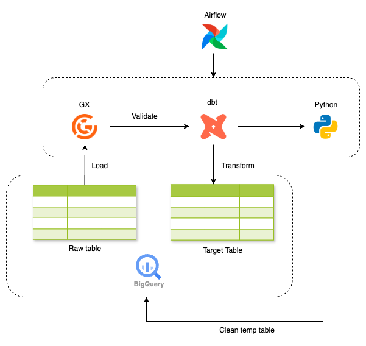
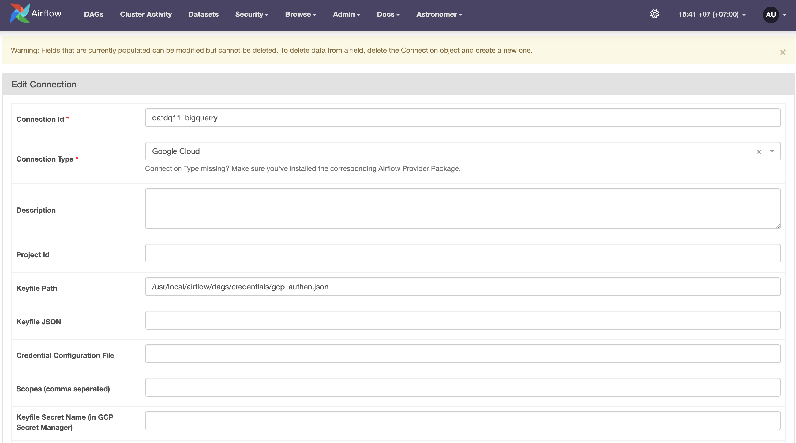
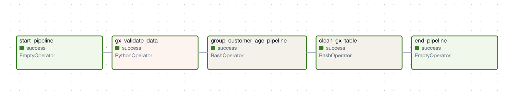
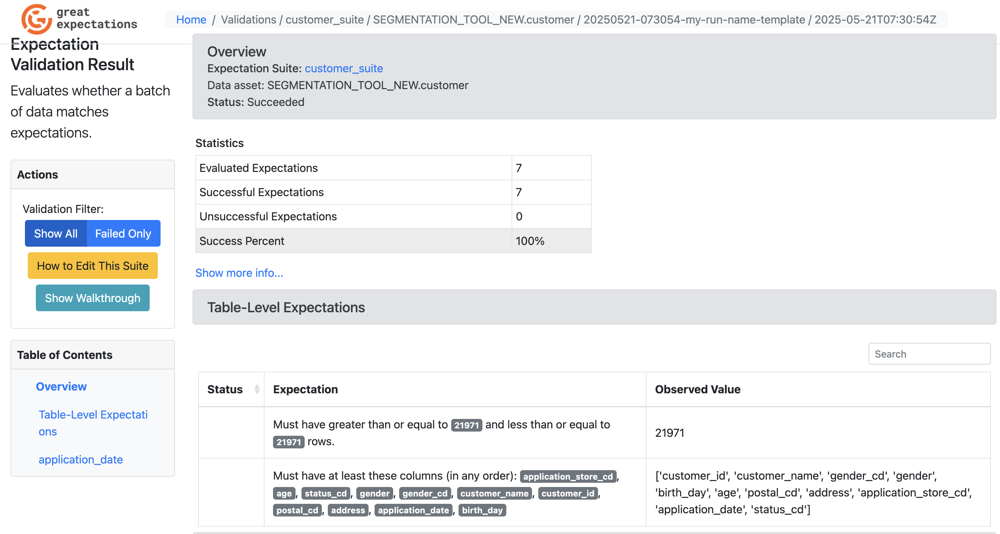

# Architect


In this repo, I will demo a simple data processing workflow using Great Expectations, dbt, Airflow and Google BigQuerry

# Implementation

## Step 0: Install init environment

* Setup packages
    ```
    pip install dbt-core dbt-bigquery great_expectations==0.18.21
    ```
* Setup GCP service account and save json file : https://cloud.google.com/iam/docs/service-accounts-create

* Create table **customer** in BigQuerry Table from this data : https://github.com/The-Japan-DataScientist-Society/100knocks-preprocess/blob/master/docker/work/data/customer.csv

## Step 1 : Setup Airflow

* Install astro : https://www.astronomer.io/docs/astro/cli/install-cli/
* Init project : 

    ```
    astro dev init
    ```
* Add required library to Dockerfile

    ```
    FROM quay.io/astronomer/astro-runtime:12.9.0
    RUN pip install dbt-core dbt-bigquery great_expectations==0.18.21 sqlalchemy_bigquery google-cloud-bigquery
    ```

* Setup BigQuerry Connection


* Run Airflow
    ```
    astro dev start
    ```

## Step 2 : Setup dbt
* Init dbt project

    ```
    dbt init dbt_project
    ```
* Setup models and profiles
* Copy folder **dbt_project** to **dags/** folder

## Step 3 : Setup great_expectations

* Init great expectations project
    ```
    great_expectations init
    ```
* Connect to datasource, then modify datasource (here we used Big Querry SQL)
    ```
    great_expectations datasource new --no-jupyter
    ```
* Create expectations for fiels
    ```
    great_expectations suite new --no-jupyter
    ```
* Create checkpoint for validating
    ```
    great_expectations checkpoint new checkpoint_customer
    ```
* Copy **gx** folder to **dags/** folder

Step 4: Check result
* Airflow result

* GX docs

